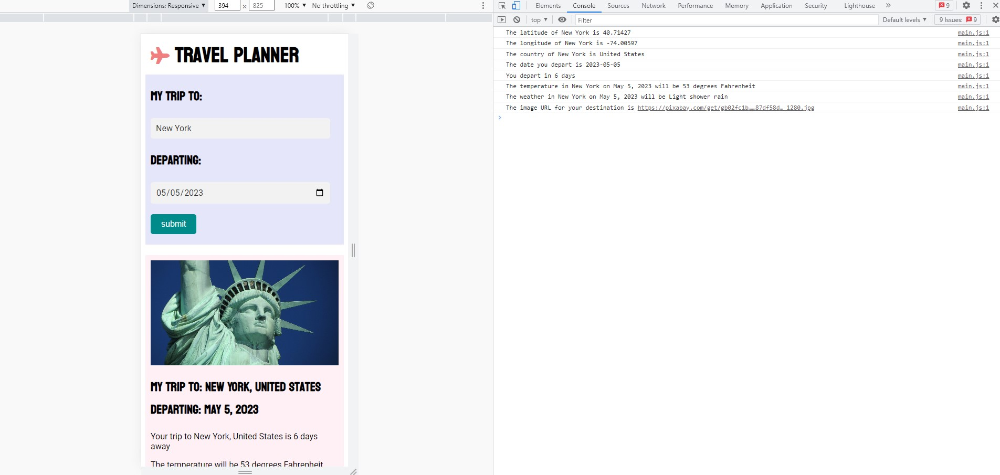

# Travel Planner

<!--  -->

## Project Description

This is a project developed as part of the Udacity Front End Web Developer Nanodegree as the final project.

This application allows you to input dates and get information about the weather in that location your are travelling to.

The purpose of developing this project is to demonstrate knowledge of build tools, JavaScript, APIs, HTML and CSS. In this project I utilise Jest, Webpack, Workbox Service Workers, Node, Express and APIs to acheive this.

## How to run this file

1. Install the zip folder to your local computer.
2. In your IDE of choice run 'npm install' to install all the dependencies from the 'package.json' file
<!-- 3. Create a '.env' file and fill it with an 'API_KEY'. -->
4. Using the magic of webpack you can this in either 'Producton mode' or 'Development mode'. 'Production mode' is on port 8081 and requires you to run 'npm run build-prod' followed by 'npm start'. 'Development mode' runs on port 8080 and requires you to run 'npm run build-dev'